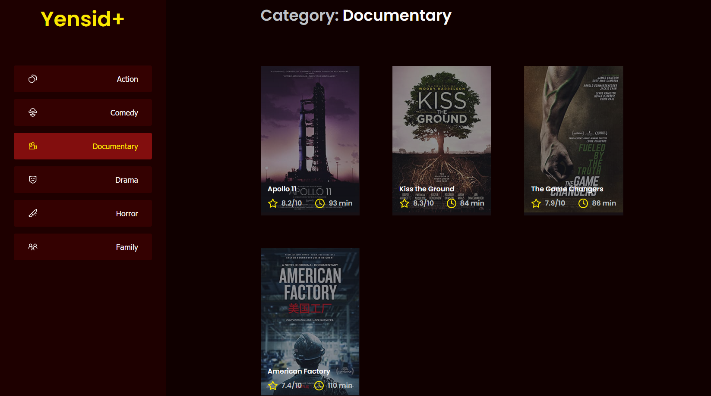

<h1 align="center">
  MinhaVerba
</h1>
<h1 align="center">
    
</h1>

<br>

## 🧪 Technologies

This project was made using the followings Technologies:
- [React](https://reactjs.org)
- [TypeScript](https://www.typescriptlang.org/)
- [JSON Viewer](https://github.com/typicode/json-server)

## 🪐 Running
Para iniciá-lo, siga os passos abaixo:
```bash
# Install all dependencies
$ yarn

# Starting JSON server
$ yarn server 

# Starting App on DevMode
$ yarn dev

```
App will be available on port: http://localhost:8080.